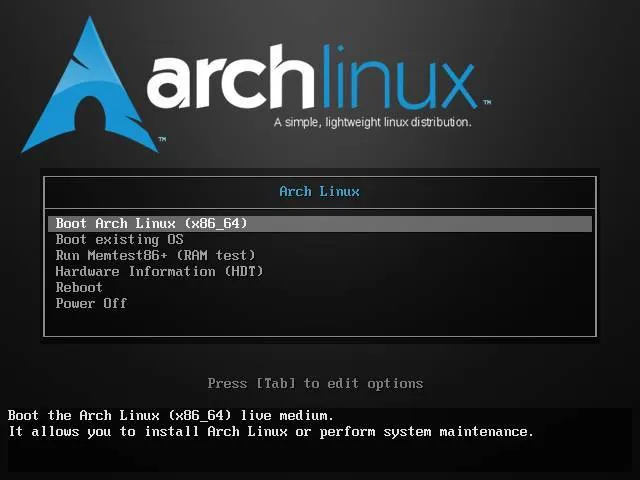
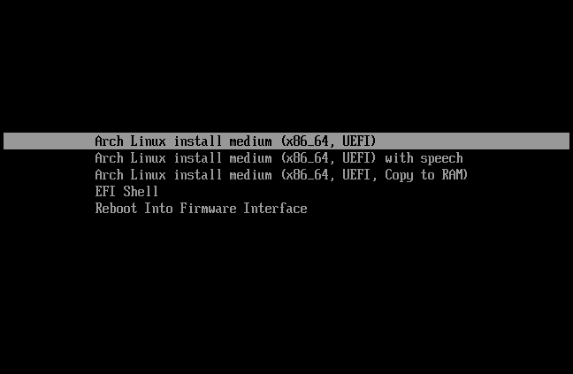

# Guía de Instalación de Arch Linux


<p>
Arch Linux es un sistema operativo basado en Linux que tiene características ideales para usuarios medios y avanzados que buscan principalmente dos cualidades: mantener el sistema operativo ligero y seguir el principio del acrónimo KISS (Keep It Simple, Stupid). Su primer lanzamiento fue en marzo de 2002 y posee una comunidad de usuarios y contribuidores bastante activa.

Antes de empezar, aclaramos que no es una distribución basada en otra distribución, sino la raíz de una familia de distribuciones de Linux que cubren esa misma filosofía. 
</p>

## Requisitos Previos
- USB con capacidad mínima de 8GB
- Acceso a internet durante la instalación
- Conocimientos básicos de línea de comandos en linux

### Índice

1. [Descargar la Imagen ISO](#1-descargar-la-imagen-iso)
2. [Crear USB Booteable](#2-crear-usb-booteable)
3. [Iniciar desde USB](#3-iniciar-desde-usb)
    - [Configuracion del teclado](#31-configuracion-del-teclado)
4. [Modo de arranque](#4-modo-de-arranque)
5. [Conexion a internet](#5-conexion-a-internet)
    - [Ethernet](#51-ethernet)
    - [WiFi](#52-wifi)
6. [Particionar el disco](#6-particionar-el-disco)
7. [Formatear particiones](#7-formatear-particiones)
    - [Particion Swap](#71-particion-swap)
8. [Montar particiones](#8-montar-particiones)
9. [Instalar paquetes base](#9-instalar-paquetes-base)
10. [Generar fstab](#10-generar-fstab)
11. [Ingreso al Sistema](#11-ingreso-al-sistema)
12. [Configurar zona horaria](#12-configurar-zona-horaria)
13. [Configurar idioma y localización](#13-configurar-idioma-y-localización)
14. [Configuracion de red](#14-configuracion-de-red)
    - [Instalacion del administrador de redes](#141-instalacion-del-administrador-de-redes)
15. [Agregar un usuario y contraseña](#15-agregar-un-usuario-y-contraseña)
    - [Configuracion de usuario](#151-configuracion-de-usuario)
16. [GRUB](#16-grub)
    - [UEFI](#161-uefi)
    - [BIOS](#162-bios)
17. [Instalación de Arch linux completada](#17-instalación-de-arch-linux-completada)
    - [Recursos adicionales](#recursos-adicionales)

## Pasos de Instalación

### 1. Descargar la Imagen ISO

```bash
# Descarga desde el sitio oficial
https://archlinux.org/download/
```

### 2. Crear USB Booteable

##### En Linux:
```bash
sudo dd if=archlinux-x86_64.iso of=/dev/sdX bs=4M status=progress
sudo sync
```

##### En Windows:

- Usa herramientas como Rufus o ventoy
- Selecciona el archivo ISO y la unidad USB
- Haz clic en "Grabar/Guardar"

### 3. Iniciar desde USB

- Reinicia tu equipo
- Accede a la BIOS (usualmente SUPR, DEL, ESC o F2)
- Selecciona tu USB como dispositivo de inicio

#### 3.1 Configuracion del teclado
```bash
# Teclado español - latam
loadkeys la-latin1
```

### 4. Modo de arranque
```bash
# Verificar el modo de arranque (BIOS, UEFI)
ls /sys/firmware/uefi 
```
> Nota: Si aparece directorios dentro de UEFI es porque se arranco de ese modo caso contrario esta en modo BIOS.

<details>
<summary>Modo BIOS</summary>

</details>

<details>
<summary>Modo UEFI</summary>

</details>

### 5. Conexion a internet

```bash
# Comprueba si la interfaz de red esta habilitada
 ip link
```
#### 5.1 Ethernet
conectar un cable de red 
- Cat 5
- Cat 5e
- Cat 6
- Cat 6e, etc.

#### 5.2 WiFi
```bash
# Asegurate que la tarjeta de red no este bloqueada con rfkill
rfkill list
```
```bash
# Si el kernel bloquea la tarjeta desactivelo
rfkill unblock wifi
```

```bash
# Enviar una peticion a iwd para autentificarse a una red inalambrica
iwctl
```
``` bash
# Lista de dispositivos
[iwd] device list
```
```bash
# Buscar redes
station [device] scan
```
```bash
# Lista de redes escaneadas
station [device] get-networks
```
```bash
# Conectarse a la red 
station [device] connect [SSID]
```
```bash
# Verificar conexion
[iwd] station [device] show
```
```bash
# Ctrl + c
exit
```

### 6. Particionar el Disco
Utilizando una herramienta de particionamiento más adecuada para tu sistema (gdisk, fdisk, cfdisk, etc.), crea una nueva tabla de particiones **GPT** o **MBR**, si no existe. Se requiere una tabla **GPT** en modo UEFI; se requiere una tabla **MBR** si el sistema arranca en modo BIOS.

```bash
# Listar discos disponibles
lsblk
# Crear particiones
cfdisk 
```
**UEFI con GPT**
| montaje | Particion | Tipo de archivo   | Tamaño   |
|:-------:|-----------|-------------------|:---------|
| /boot   | /dev/uefi |efi_System         |1GB       |
| /       | /dev/root |linux_file         |+23GiB    |
| [SWAP]  | /dev/swap |linux_swap         |4GiB      |

**BIOS con MBR**
| montaje | Particion | Tipo de archivo   | Tamaño   |
|:-------:|-----------|-------------------|:---------|
| /       | /dev/root |linux_file         |+23GiB    |
| [SWAP]  | /dev/swap |linux_swap         |4GiB      |


### 7. Formatear Particiones

```bash
# Formatear EFI 
mkfs.fat -F 32 /dev/<efi_particion>

# Formatear root 
mkfs.ext4 /dev/<root_partition>
```
#### 7.1 Particion Swap
```bash
mkswap /dev/<swap_partition>

# activar la particion swap
swapon /dev/<swap_partition>
```

### 8. Montar Particiones

```bash
# Montar root
mount /dev/<root_partition> /mnt

# Crear directorio boot
mkdir -p /mnt/boot
mount /dev/<efi_partition> /mnt/boot

```

### 9. Instalar Paquetes Base

```bash
pacstrap -K /mnt base linux linux-firmware [cpu]-ucode nano sudo
```

### 10. Generar fstab

```bash
genfstab -U /mnt >> /mnt/etc/fstab
```

### 11. Ingreso al Sistema

```bash
arch-chroot /mnt
```
### 12. Configurar zona horaria
```bash
#Listar zonas horarias
timedatectl list-timezones

# Establecer zona horaria
ln -sf /usr/share/zoneinfo/<Region>/<Ciudad> /etc/localtime 
hwclock --systohc
```
### 13. Configurar Idioma y Localización

```bash
# Editar locale.gen
nano /etc/locale.gen
# Descomenta: es_ES.UTF-8 UTF-8 (o tu idioma)

# Generar locales
locale-gen

# Crear archivo locale.conf
echo "LANG=es_ES.UTF-8" > /etc/locale.conf
```
### 14. Configuracion de red
Creacion del nombre de usuario
```bash
echo [hostname] > /etc/hostname
```
Añade tu maquina al directorio:
```bash
nano /etc/hosts

127.0.0.1    localhost  
::1          localhost  
127.0.0.1    [hostname].localhost [hostname]
```

#### 14.1 Instalacion del administrador de redes

```bash
pacman -S networkmanager

# Activando el servicio de red
systemctl enable --now NetworkManager
```
### 15. Agregar un usuario y contraseña

#### 15.1 Configuracion de usuario
Creamos un nuevo usuario 
```bash
useradd -m [username]
```
Agregamos al grupo wheel
```bash
usermod -aG wheel [username]
```
Descomentamos la parte de **%wheel ALL=(ALL:ALL) ALL**
```bash
EDITOR=nano visudo
```
#### 15.2 Contraseña
```bash
# contraseña para usuario root:
passwd 

# contraseña para [username]:
passwd [username]
```

### 16 GRUB
Instalacion de grub y os-prober para agregar automaticamente entradas de arranque para otros sistemas operativos.

```bash
pacman -S grub os-prober
```
#### 16.1 UEFI

```bash
pacman -S efibootmgr
```
Instalar el grub en la particion efi que anteriormente creamos

```bash
grub-install --target=x86_64-efi --efi-directory=/boot --bootloader-id=GRUB
```
Generar el archivo de configuracion para el GRUB

```bash
grub-mkconfig -o /boot/grub/grub.cfg
```

#### 16.2 BIOS
Instalar grub para el modo de arranque BIOS
```bash
grub-install --target=i386-pc /dev/sda
```
Generar el archivo de configuracion para el GRUB

```bash
grub-mkconfig -o /boot/grub/grub.cfg
```
Si sale una advertencia que os-prober no se ejecutará, descomenta 'GRUB_DISABLE_OS_PROBER=false' en la siguiente ruta:

```bash
nano /etc/default/grub
```
### 17 Instalación de Arch linux completada
Salir de arch-chroot /mnt

```bash
exit
```
Desmontamos las particiones y reiniciamos

```bash
umount -R /mnt

# Reiniciando el sistema
reboot 
```
## 📚 Recursos Útiles
- [Wiki Oficial de Arch Linux](https://wiki.archlinux.org/)
- [Guía de Instalación Oficial](https://wiki.archlinux.org/title/Installation_guide)

## Notas Importantes

- Arch Linux es una distribución "rolling release", requiere mantenimiento regular
- Actualiza tu sistema frecuentemente:`sudo pacman -Syu`
- Lee las noticias en [archlinux.org](https://archlinux.org/) antes de actualizar
- La comunidad es muy activa y hay excelente documentación disponible

---
**¡Bienvenido a Arch Linux!**